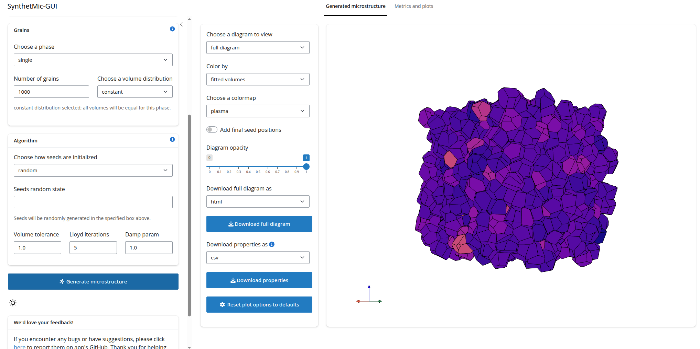
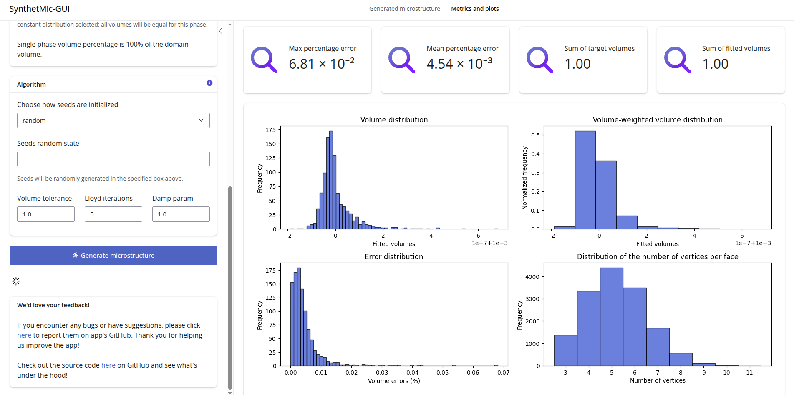

# SynthetMic-GUI
### About
SynthetMic-GUI is a web app for generating 2D and 3D synthetic polycrystalline microstructures using Laguerre tessellations.
It uses the fast algorithms (developed in this [paper](https://www.tandfonline.com/doi/full/10.1080/14786435.2020.1790053))
for generating grains of prescribed volumes using optimal transport theory. It is built on
top of [SynthetMic](https://github.com/synthetic-microstructures/synthetmic) package which is the Python implementation of the fast algorithms.

This app is available at this [link](link to the app).




### Local set up
If you would like to build this project from source either for development purposes or for any other reason, it is recommended to install [uv](https://docs.astral.sh/uv/). This is what is adopted in this project. To install uv, follow the instructions in this [link](https://docs.astral.sh/uv/getting-started/installation/).

If you don't want to use uv, you can use other alternatives like [pip](https://pip.pypa.io/en/stable/).

The following instructions use uv for setting up the app locally.

1. Clone the repository by running

    ```
    git clone https://github.com/synthetic-microstructures/synthetmic-gui
    ```

1. Create a python virtual environment by running

    ```
     uv venv .venv --python PYTHON_VERSION
    ```
    > Here, PYTHON_VERSION is the supported Python version. Note that this project requires version >=3.12.3

1. Activate the virtual environment by running

    ```
    source .venv/bin/activate
    ```

1. Prepare all modules and dependencies by running the following:

    ```
    uv sync --all-extras
    ```
1. Start the app by running:
    
    ```
    shiny run app.py --reload
    ```
    > `--reload` flag ensures the app is reloaded whenever changes are made to the source codes.

### Authors and maintainers
- [R. O. Ibraheem](https://github.com/Rasheed19)
- [D. P. Bourne](https://github.com/DPBourne)
- [S. M. Roper](https://github.com/smr29git)

### Roadmap
- [ ] put restriction on the number of grains; you dont want the algorithm to run forever!
- [ ] add functionality of color by: phase, texture.
- [ ] allow for selective periodicity
- [ ] triangulation
